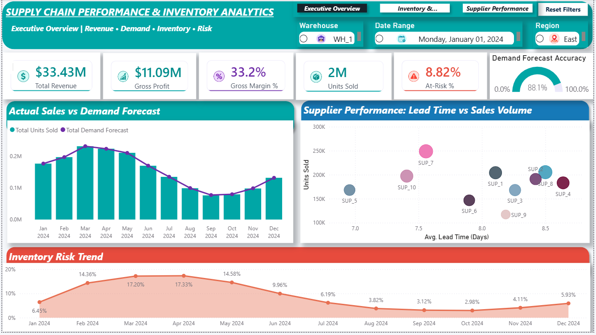
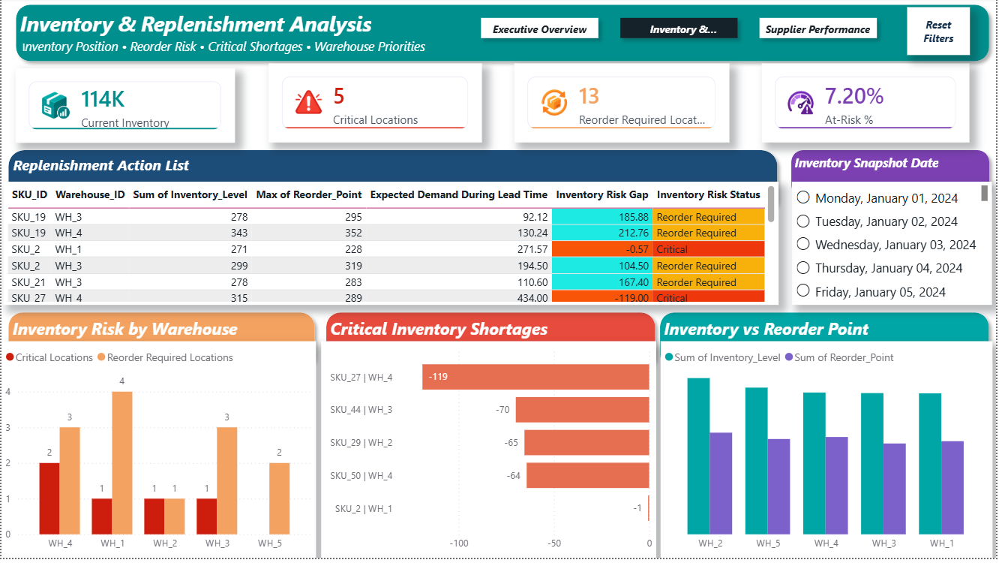
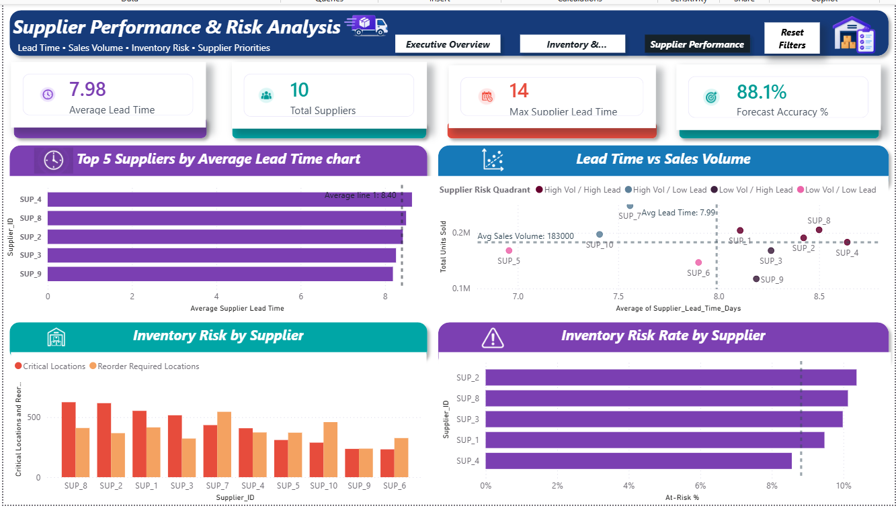

# Supply Chain Performance & Inventory Analytics

An end-to-end supply chain analytics portfolio project focused on **inventory risk, replenishment priorities, supplier performance, demand forecasting, and executive decision support**.

The project uses **SQL and Power BI** to transform daily supply chain activity into an interactive three-page dashboard designed to help decision-makers understand operational performance, identify inventory shortages, prioritize replenishment, and evaluate supplier risk.

## Project Overview

The dataset contains daily supply chain activity at the **SKU, warehouse, supplier, region, and date** level. The analysis brings together sales demand, inventory levels, reorder thresholds, supplier lead times, and demand forecasts to answer practical supply chain questions.

The final Power BI report is organized into three analytical views:

1. **Executive Overview** — high-level revenue, profitability, demand, forecast accuracy, supplier performance, and inventory risk.
2. **Inventory & Replenishment Analysis** — inventory position, critical shortages, reorder requirements, warehouse priorities, and a replenishment action list.
3. **Supplier Performance & Risk Analysis** — supplier lead time, sales volume, inventory risk exposure, and supplier risk prioritization.

## Business Problem

Supply chain teams need to balance product availability with inventory efficiency while managing supplier uncertainty. The goal of this project was to create a decision-support solution that helps answer questions such as:

- How are revenue, profit, sales volume, and demand trending?
- How accurately does the demand forecast track actual demand?
- Which SKU and warehouse combinations require replenishment attention?
- Where are the most critical inventory shortages?
- Which warehouses carry the greatest inventory risk?
- Which suppliers combine high sales volume with longer lead times?
- Which suppliers have the highest inventory risk rates?

## Tools & Technologies

- **Power BI Desktop** — data modeling, DAX, interactive dashboards, bookmarks, slicers, navigation, conditional formatting, and visual analytics
- **SQL** — supply chain data analysis and validation
- **Power Query** — data preparation and transformation
- **DAX** — KPI, inventory risk, supplier performance, ranking, and forecast measures
- **Data Modeling** — fact/dimension model with supplier, SKU, warehouse, and date dimensions

## Key Metrics

The dashboard tracks metrics including:

- Total Revenue
- Gross Profit
- Gross Margin %
- Total Units Sold
- Demand Forecast Accuracy
- Current Inventory
- Critical Locations
- Reorder Required Locations
- At-Risk %
- Average Supplier Lead Time
- Maximum Supplier Lead Time
- Total Suppliers

## Dashboard Pages

### 1. Executive Overview

The Executive Overview provides a consolidated view of business and supply chain performance. It combines financial KPIs with actual demand, forecast performance, supplier lead time versus sales volume, and the monthly inventory risk trend.



**Highlights**
- Revenue: **$33.43M**
- Gross Profit: **$11.09M**
- Gross Margin: **33.2%**
- Units Sold: **2M**
- Overall At-Risk Rate: **8.82%**
- Demand Forecast Accuracy: **88.1%**

The page also includes warehouse, date, and region filters plus report navigation and reset functionality.

### 2. Inventory & Replenishment Analysis

This page focuses on operational inventory decisions. It identifies SKU/warehouse combinations that require attention and compares current inventory with expected demand and reorder thresholds.



**Key capabilities**
- Inventory snapshot analysis by date
- Critical shortage identification
- Reorder-required classification
- Inventory risk gap calculation
- Warehouse-level risk comparison
- Inventory versus reorder-point analysis
- Replenishment Action List for operational prioritization

The action table uses conditional formatting to make **Critical** and **Reorder Required** records immediately visible.

### 3. Supplier Performance & Risk Analysis

This page evaluates supplier performance using lead time, sales volume, and inventory risk.



**Key capabilities**
- Top suppliers by average lead time
- Lead Time vs Sales Volume supplier analysis
- Supplier risk quadrant classification
- Critical and reorder-required inventory exposure by supplier
- Supplier At-Risk % ranking
- Overall supplier risk benchmark

The risk quadrant separates suppliers into combinations of **high/low volume** and **high/low lead time**, helping identify suppliers that may deserve closer operational attention.

## Selected DAX Logic

Examples of analytical logic developed for the report include:

```DAX
Total Units Sold =
SUM(FactSupplyChain[Units_Sold])
```

```DAX
Average Units per Supplier =
AVERAGEX(
    VALUES(DimSupplier[Supplier_ID]),
    [Total Units Sold]
)
```

Supplier risk categories were also created using supplier lead time and sales volume benchmarks so the scatter plot could communicate operational priority rather than simply display individual suppliers.

## Key Findings

- Overall **Demand Forecast Accuracy is 88.1%**, indicating that forecasted demand generally tracks actual sales reasonably closely.
- The overall supplier **At-Risk rate is 8.82%**, while risk varies across individual suppliers.
- **SUP_2 and SUP_8** are among the suppliers with the highest inventory risk rates.
- **SUP_7** has the highest sales volume while maintaining a below-average lead time, making it an important high-volume supplier to monitor.
- Supplier lead-time and sales-volume analysis reveals that supplier importance cannot be evaluated using lead time alone; operational exposure also depends on sales volume and inventory risk.
- The replenishment view identifies specific SKU/warehouse combinations with negative inventory risk gaps, enabling action at a more operational level than aggregate KPIs alone.

## Business Recommendations

- Prioritize replenishment for records classified as **Critical** before standard reorder-required locations.
- Review high-risk suppliers using both **At-Risk % and inventory exposure counts**, rather than relying on lead time alone.
- Closely monitor suppliers that combine **high sales volume and above-average lead time**, because disruption could affect a larger portion of demand.
- Use the inventory snapshot view for daily replenishment decisions and the supplier page for longer-term supplier performance reviews.
- Continue monitoring forecast accuracy alongside inventory risk to determine whether demand-planning changes reduce future shortage exposure.

## Skills Demonstrated

- Business problem framing
- Supply chain KPI development
- Data cleaning and transformation
- Dimensional data modeling
- DAX measure development
- Inventory risk analysis
- Replenishment analysis
- Supplier performance analysis
- Demand forecast evaluation
- Conditional formatting and analytical benchmarking
- Interactive Power BI navigation and bookmarks
- Dashboard design and data storytelling

## Repository Contents

```text
supply-chain-inventory-analytics/
├── README.md
├── executive-overview.png
├── inventory-replenishment.png
└── supplier-performance.png
```

Additional project files such as SQL analysis scripts and the Power BI report can be added to the repository as the portfolio documentation is expanded.

---

### Portfolio Project

Built as an end-to-end data analytics portfolio project demonstrating how **SQL, Power BI, DAX, data modeling, and business analysis** can be combined to turn supply chain data into actionable inventory and supplier insights.
